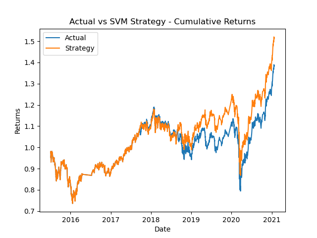
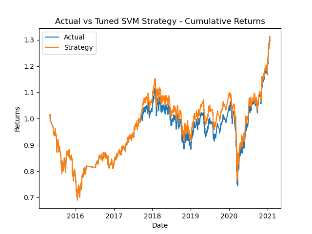
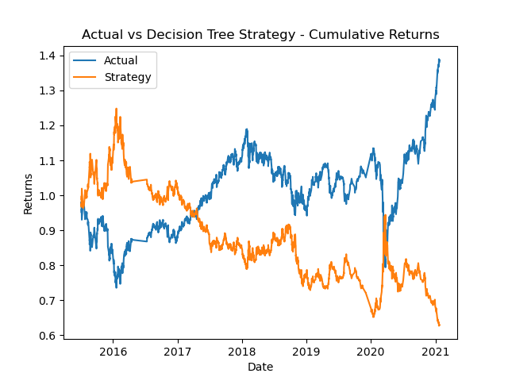

# Machine Learning Trading Bot

Now, it's time to take what you've learned about machine learning and apply it to new situations. For this optional assignment, you'll create an algorithmic trading bot that learns and adapts to new data and evolving markets. Be sure to give it your all -- as the skills you hone will become powerful tools in your FinTech tool belt.

## Background

In this Challenge, you’ll assume the role of a financial advisor at one of the top five financial advisory firms in the world. Your firm constantly competes with the other major firms to manage and automatically trade assets in a highly dynamic environment. In recent years, your firm has heavily profited by using computer algorithms that can buy and sell faster than human traders.

The speed of these transactions gave your firm a competitive advantage early on. But, people still need to specifically program these systems, which limits their ability to adapt to new data. You’re thus planning to improve the existing algorithmic trading systems and maintain the firm’s competitive advantage in the market. To do so, you’ll enhance the existing trading signals with machine learning algorithms that can adapt to new data.

## What You're Creating

You’ll combine your new algorithmic trading skills with your existing skills in financial Python programming and machine learning to create an algorithmic trading bot that learns and adapts to new data and evolving markets.

In a Jupyter notebook, you’ll do the following:

* Implement an algorithmic trading strategy that uses machine learning to automate the trade decisions.

* Adjust the input parameters to optimize the trading algorithm.

* Train a new machine learning model and compare its performance to that of a baseline model.

As part of your GitHub repository’s `README.md` file, you will also create a report that compares the performance of the machine learning models based on the trading predictions that each makes and the resulting cumulative strategy returns.

## Files

Download the following files to help you get started:

* [machine_learning_trading_bot Notebook](machine_learning_trading_bot.ipynb)
* [`emerging_markets_ohlcv` CSV File](Resources/emerging_markets_ohlcv.csv)

> **Note:** The provided CSV file contains OHLCV data for an MSCI&ndash;based emerging markets ETF that [iShares](https://www.ishares.com/us/products/268704/ishares-currency-hedged-msci-emerging-markets) issued. Investments in emerging markets make up an important aspect of a well-diversified investment portfolio. This is because the included equities have potentially higher long-term returns, even though they carry more risk.

## Instructions

Use the starter code file to complete the steps that the instructions outline. The steps for this Challenge are divided into the following sections:

* Establish a Baseline Performance

* Tune the Baseline Trading Algorithm

* Evaluate a New Machine Learning Classifier

* Create an Evaluation Report

### Establish a Baseline Performance

In this section, you’ll run the provided starter code to establish a baseline performance for the trading algorithm. To do so, complete the following steps.

Open the Jupyter notebook. Restart the kernel, run the provided cells that correspond with the first three steps, and then proceed to step four.

1. Import the OHLCV dataset into a Pandas DataFrame.

2. Generate trading signals using short- and long-window SMA values.

3. Split the data into training and testing datasets.

4. Use the `SVC` classifier model from SKLearn's support vector machine (SVM) learning method to fit the training data and make predictions based on the testing data. Review the predictions.

5. Review the classification report associated with the `SVC` model predictions.

6. Create a predictions DataFrame that contains columns for “Predicted” values, “Actual Returns”, and “Strategy Returns”.

7. Create a cumulative return plot that shows the actual returns vs. the strategy returns. Save a PNG image of this plot. This will serve as a baseline against which to compare the effects of tuning the trading algorithm.

8. Write your conclusions about the performance of the baseline trading algorithm in the `README.md` file that’s associated with your GitHub repository. Support your findings by using the PNG image that you saved in the previous step.

### Tune the Baseline Trading Algorithm

In this section, you’ll tune, or adjust, the model’s input features to find the parameters that result in the best trading outcomes. (You’ll choose the best by comparing the cumulative products of the strategy returns.) To do so, complete the following steps:

1. Tune the training algorithm by adjusting the size of the training dataset. To do so, slice your data into different periods. Rerun the notebook with the updated parameters, and record the results in your `README.md` file. Answer the following question: What impact resulted from increasing or decreasing the training window?

    > **Hint** To adjust the size of the training dataset, you can use a different `DateOffset` value&mdash;for example, six months. Be aware that changing the size of the training dataset also affects the size of the testing dataset.

2. Tune the trading algorithm by adjusting the SMA input features. Adjust one or both of the windows for the algorithm. Rerun the notebook with the updated parameters, and record the results in your `README.md` file. Answer the following question: What impact resulted from increasing or decreasing either or both of the SMA windows?

3. Choose the set of parameters that best improved the trading algorithm returns. Save a PNG image of the cumulative product of the actual returns vs. the strategy returns, and document your conclusion in your `README.md` file.

### Evaluate a New Machine Learning Classifier

In this section, you’ll use the original parameters that the starter code provided. But, you’ll apply them to the performance of a second machine learning model. To do so, complete the following steps:

1. Import a new classifier, such as `AdaBoost`, `DecisionTreeClassifier`, or `LogisticRegression`. (For the full list of classifiers, refer to the [Supervised learning page](https://scikit-learn.org/stable/supervised_learning.html) in the scikit-learn documentation.)

2. Using the original training data as the baseline model, fit another model with the new classifier.

3. Backtest the new model to evaluate its performance. Save a PNG image of the cumulative product of the actual returns vs. the strategy returns for this updated trading algorithm, and write your conclusions in your `README.md` file. Answer the following questions: Did this new model perform better or worse than the provided baseline model? Did this new model perform better or worse than your tuned trading algorithm?

### Create an Evaluation Report

In the previous sections, you updated your `README.md` file with your conclusions. To accomplish this section, you need to add a summary evaluation report at the end of the `README.md` file. For this report, express your final conclusions and analysis. Support your findings by using the PNG images that you created.

# Evaluation Report

### **Baseline Algorithm**
Compared to the actual returns, the SVM strategy performed the same from early 2015 to late 2017, worse from late 2017 to late 2018, and better from late 2019 until early 2021. While this improvement over the latter three years was impressive and more pronounced than previously seen, the strategy still performed at or below the market for the majority of the timeframe. Therefore, the baseline algorithm did not exhibit desirable performance and and needs further improvements. 

### **Tuned SVM Algorithm**
The Baseline Algorithm was changed to have an offset window of 1 month (instead of three) and a short window of 10 (instead of 4). This new strategy performed roughtly the same as the marked from early 2015 to mid 2017 and then better than the market from mid 2017 to early 2021. This means that it outperformed the marked for the majority of the timeframe and is therefore better than the previous SVM strategy. 

### **Decision Tree Algorithm**
Compared to the actual returns, the DecisionTree strategy performed better from early 2015 to early 2017. From early 2017 onward, it generally performed much worse than the market with any improvements being both rare and reletively brief. From this, we can conclude that the strategy performed very poorly compared to the baseline algorithm and should therefore be avoided. 

### **Results**
Model Evaluation Scores:
* SVM Model:  
  * Sell Signals:
    * Precision: 0.43 (43%)
    * Recall: 0.04 (4%)
  * Buy Signals:
    * Precision: 0.56 (56%)
    * Recall: 0.96 (96%)

* Tuned SVM Model:  
  * Sell Signals:
    * Precision: 0.44 (44%)
    * Recall: 0.83 (83%)
  * Buy Signals:
    * Precision: 0.55 (55%)
    * Recall: 0.16 (16%)

* Decision Tree:
  * Sell Signals:
    * Precision: 0.39 (39%)
    * Recall: 0.01 (1%)
  * Buy Signals:
    * Precision: 0.56 (56%)
    * Recall: 0.99 (99%)

### **Summary**
From the above scores, we can see that the original SVM and decision tree models are both good at detecting buy signals but bad at detecting sell signals. The tuned SVM model, on the other hand, seems to be the complete opposite. It was able to correctly identify sell signals at a far greater rate than the other two..

While buying is certainly important, gains can very easily be wiped out if positions are not exited properly. It is therefore imperative for a model to accurately detect sell signals and respond accordingly.

This is likely the reason for the tuned algorithm's superior performance as mentioned previously. While further optimization is certainly needed, I can confidently say that this strategy is the best out of the three and should be recommended.

---