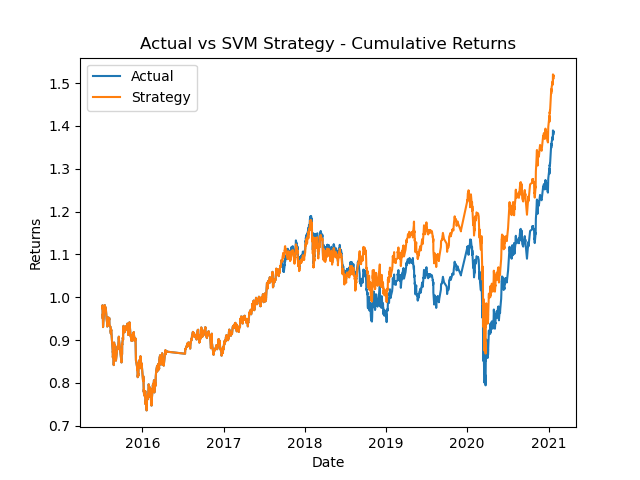

# Evaluation Report

### **Baseline Algorithm**
Compared to the actual returns, the SVM strategy performed the same from early 2015 to late 2017, worse from late 2017 to late 2018, and better from late 2019 until early 2021. While this improvement over the latter three years was impressive and more pronounced than previously seen, the strategy still performed at or below the market for the majority of the timeframe. Therefore, the baseline algorithm did not exhibit desirable performance and and needs further improvements. 

### **Tuned SVM Algorithm**
The Baseline Algorithm was changed to have an offset window of 1 month (instead of three) and a short window of 10 (instead of 4). This new strategy performed roughtly the same as the marked from early 2015 to mid 2017 and then better than the market from mid 2017 to early 2021. This means that it outperformed the marked for the majority of the timeframe and is therefore better than the previous SVM strategy. 

### **Decision Tree Algorithm**
Compared to the actual returns, the DecisionTree strategy performed better from early 2015 to early 2017. From early 2017 onward, it generally performed much worse than the market with any improvements being both rare and reletively brief. From this, we can conclude that the strategy performed very poorly compared to the baseline algorithm and should therefore be avoided. 

### **Results**
Model Evaluation Scores:
* SVM Model:  
  * Sell Signals:
    * Precision: 0.43 (43%)
    * Recall: 0.04 (4%)
  * Buy Signals:
    * Precision: 0.56 (56%)
    * Recall: 0.96 (96%)

* Tuned SVM Model:  
  * Sell Signals:
    * Precision: 0.44 (44%)
    * Recall: 0.83 (83%)
  * Buy Signals:
    * Precision: 0.55 (55%)
    * Recall: 0.16 (16%)

* Decision Tree:
  * Sell Signals:
    * Precision: 0.39 (39%)
    * Recall: 0.01 (1%)
  * Buy Signals:
    * Precision: 0.56 (56%)
    * Recall: 0.99 (99%)

### **Summary**
From the above scores, we can see that the original SVM and decision tree models are both good at detecting buy signals but bad at detecting sell signals. The tuned SVM model, on the other hand, seems to be the complete opposite. It was able to correctly identify sell signals at a far greater rate than the other two..

While buying is certainly important, gains can very easily be wiped out if positions are not exited properly. It is therefore imperative for a model to accurately detect sell signals and respond accordingly.

This is likely the reason for the tuned algorithm's superior performance as mentioned previously. While further optimization is certainly needed, I can confidently say that this strategy is the best out of the three and should be recommended.

---